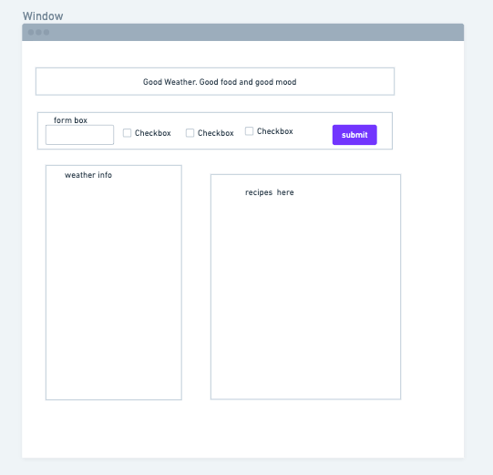
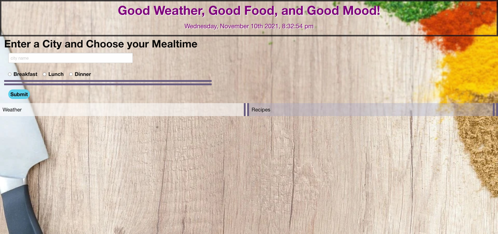
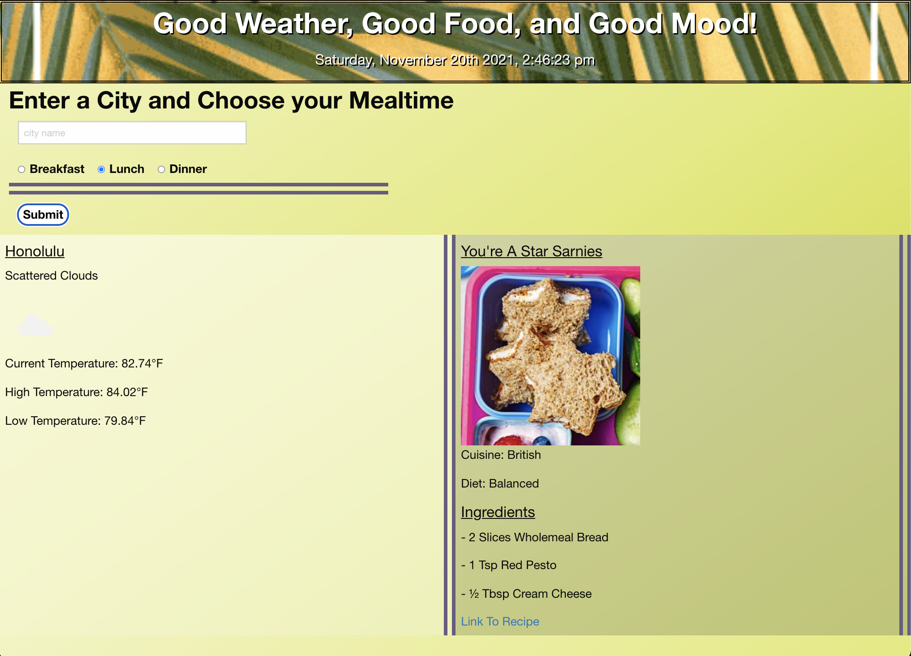

# Good Weather, Good Food, and Good Mood!
 
# Purpose

For this project, our goal was to give users weather data for a specific city along with a corresponding recipe depending on the temperature of their city and the current temperature. Users input a city name and select a mealtime of breakfast, lunch or dinner in order to see weather data and a recipe recommendation. 

We used a combination of 2 APIs for weather and recipe data, combined with javascript functions and a CSS framework called Foundation, to execute the code. Other elements involved in our coding process was the use of client-side storage, jQuery and error handling.

# liveLink

https://seasons-of-food.github.io/whats-your-food-temp/

# Technologies Used 
    HTML5 CSS3, JavaScript, moment.js, jQuery, Foundation6
## License 
  This project is licensed under the [MIT License](https://opensource.org/licenses/MIT).

# whimsical [wireframe](https://whimsical.com/groupproject-1-TKLPds47WdxkxpN6YfgMga)

# Screenshot

# Credits 2021

Fiona Nicdao, 
Janette Castillo,
Jonathan Parker,
Josshy Olea

For any further assistance, you may contact us at:
* Github: [Fiona Nicdao](<https://github.com/fiona1nicdao>)
* Github: [Josshy Olea](<https://github.com/josshy92>)
* Github: [Jonathan Parker](<https://github.com/jonathanparker21>)
* Github: [Janette Castillo](<https://github.com/jcastillo9>)
